# Hi, I'm Emir Mutlu 👋

### Full Stack Web Developer • AI Developer • Computer Science Student

  
  
  

---

## About Me

I'm a **Computer Science student at Dokuz Eylül University** and a **Full Stack Web Developer** with a growing interest in **AI-driven software development**.

I enjoy building **modern, scalable and user-friendly web applications** using technologies such as **JavaScript, TypeScript, React and Node.js**.

Alongside web development, I’m also exploring **Artificial Intelligence, LLM-based applications and AI-powered software systems**, while continuously improving my **software engineering** and **problem-solving** skills.

- 🌍 Based in **İzmir, Türkiye**
- 🎓 Studying at **Dokuz Eylül University**
- 💻 Focused on **Full Stack Web Development**
- 🤖 Interested in **AI, LLMs and intelligent software systems**
- 🌐 Portfolio: **[www.emirmutlu.com](https://www.emirmutlu.com/)**

---

## Tech Stack

  
  
  
  
  
  
  
  
  
  
  
  
  
  
  
  
  
  
  
  
  

---

## GitHub Stats

  

## Most Used Languages

  

